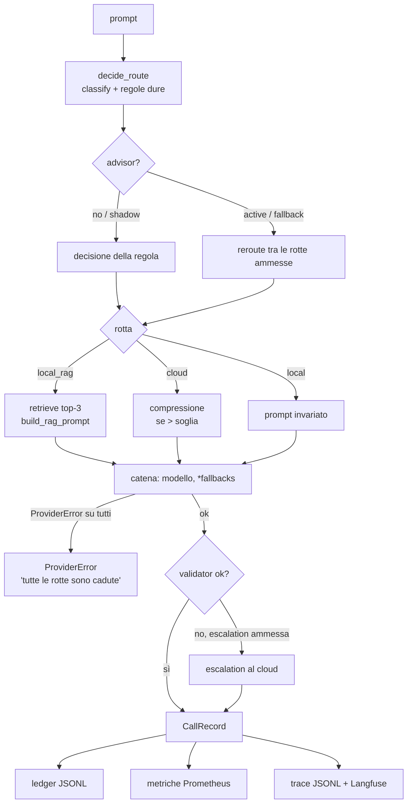

# Wiki tecnica — panoramica

Riferimento per chi sviluppa, integra o gestisce `switchable_ai`. Ogni pagina rimanda ai file sorgente; quando codice e wiki divergono, vale il codice (e la wiki va corretta).

## Indice

| # | Pagina | Contenuto |
|---|---|---|
| 00 | questa pagina | architettura, flusso, mappa delle cartelle |
| 01 | [Routing policy](01-routing-policy.md) | classificatore, regole dure, `RouteDecision` |
| 02 | [Esecuzione di una richiesta](02-esecuzione.md) | `ExecuteRequest`: RAG, compressione, fallback, escalation, `CallRecord` |
| 03 | [Configurazione](03-configurazione.md) | tutte le variabili d'ambiente, modalità diretta e gateway |
| 04 | [API HTTP](04-api-http.md) | endpoint, payload, esempi |
| 05 | [CLI e MCP](05-cli-e-mcp.md) | comandi, `run.sh`, server MCP |
| 06 | [RAG locale](06-rag.md) | sorgenti, chunking, embedding, indice |
| 07 | [Osservabilità e persistenza](07-osservabilita.md) | metriche Prometheus, Langfuse, file JSONL |
| 08 | [Infrastruttura](08-infrastruttura.md) | docker compose, LiteLLM, n8n, porte |
| 09 | [Advisor di rotta](09-advisor.md) | Rizzo Flow / Open-Jev, contratto `/v1/systemone` |
| 10 | [Costi e TCO](10-costi-e-tco.md) | prezzario, costo per chiamata, costo ammortizzato |
| 11 | [Benchmark e numeri](11-benchmark-e-numeri.md) | gli script, i risultati, `numbers.json` |
| 12 | [Test e qualità](12-test-e-qualita.md) | suite, confini, mutation testing, deck |
| 13 | [Estendere il sistema](13-estendere.md) | ricette per sviluppatori: nuovo provider, regola, tool MCP… |

## Architettura esagonale

```
            ┌───────────── ingressi ─────────────┐
            │ CLI (app/main.py)  API (app/api.py) │
            │ MCP (adapters/mcp) n8n → webhook    │
            └─────────────────┬───────────────────┘
                              │
              app/composition.py  (Container: sceglie gli adapter)
                              │
    ┌─────────────────────────▼─────────────────────────┐
    │ core/  (solo standard library)                      │
    │  domain/   policy · pricing · text · models · errors│
    │  ports/    LLMPort, EmbedderPort, VectorIndexPort…  │
    │  use_cases/ ExecuteRequest · Rag · Report · Stress  │
    │             Flywheel · Ingest · AdvisedRouter       │
    └─────────────────────────┬─────────────────────────┘
                              │ porte
    ┌─────────────────────────▼─────────────────────────┐
    │ adapters/  Ollama · OpenAI-compat (cloud, LiteLLM,  │
    │ vLLM) · SystemOne · hnswlib · JSONL · Prometheus ·  │
    │ Langfuse · compressione · filesystem · memoria      │
    └───────────────────────────────────────────────────┘
```

Vincoli (da `AGENTS.md`, verificati da `tests/test_architecture_boundaries.py`):
- `core/` importa solo la standard library e altri moduli di `core/`;
- un adapter cattura le proprie eccezioni infrastrutturali e solleva eccezioni di dominio (`core/domain/errors.py`);
- ogni caso d'uso riceve le porte nel costruttore; solo `app/composition.py` sceglie gli adapter concreti.

## Il flusso di una richiesta



## Mappa delle cartelle

| Cartella | Contenuto |
|---|---|
| `core/domain/` | `models.py` (dataclass immutabili), `policy.py` (router), `pricing.py` (prezzi, TCO), `text.py` (token, chunking, PII), `errors.py` |
| `core/ports/` | le interfacce astratte |
| `core/use_cases/` | `execute_request.py`, `rag.py`, `report.py`, `stress.py`, `flywheel.py`, `ingest.py`, `advisor.py` |
| `adapters/llm/` | `providers.py` (Ollama, OpenAI-compat, router per prefisso, indisponibile), `simulated_cloud.py`, `systemone.py`, `http.py` |
| `adapters/` (altri) | `embedding/ollama.py`, `index/hnsw.py`, `docs/filesystem.py`, `storage/jsonl.py`, `observability/sinks.py`, `compression/extractive.py`, `mcp/server.py`, `memory/` (adapter deterministici per test e stress), `system.py` (orologio, id) |
| `app/` | `composition.py` (Settings + Container), `main.py` (CLI), `api.py` (FastAPI) |
| `infra/` | `docker-compose.yml`, `litellm.yaml`, `prometheus.yml`, `grafana/`, `n8n/workflows/` |
| `benchmarks/` | script `run_*.py`, set di routing dev/heldout, `results/*.json`, `build_numbers.py` |
| `tests/` | suite pytest |
| `tools/` | mutation testing, smoke MCP, screenshot e PDF del deck, dashboard Grafana, QR, bibliografia |
| `talk/` | canovaccio, deck 3D (`deck/src`, build in `deck/dist`), `numbers.json`, replay, asset |
| `docs/` | architettura, runbook, ADR, bibliografia, guida, RCCV log |
| `wiki/` | classi, lezioni e queste tre wiki |
| `data/` | runtime, git-ignorata: registro, trace, indice, kb, flywheel |

## Dipendenze

Runtime (`pyproject.toml`): `fastapi`, `uvicorn`, `httpx`, `prometheus_client`, `hnswlib`, `numpy`, `pyyaml`, `mcp`, `requests`. Dev: `pytest`, `playwright`. Python ≥ 3.11.

Servizi esterni (tutti opzionali tranne Ollama per l'esecuzione reale): Ollama, un endpoint OpenAI-compatible (cloud o LiteLLM), vLLM, Langfuse, Prometheus, Grafana, n8n, server `/v1/systemone`.
